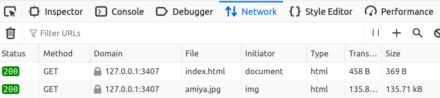
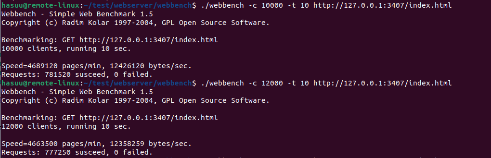

# webserver-example 

- 基于 Linux 的 C++ 高性能 Web 服务器，使用线程池 + epoll I/O多路复用技术处理高并发连接，完整解析 HTTP 请求并实现静态资源响应。


## tree

```
.
├── bin    # 可执行文件
├── build
├── code    # 源代码
│   ├── CMakeLists.txt
│   ├── http_conn.cpp 
│   └── server.cpp
├── include
│   ├── http_conn.h
│   ├── locker.h
│   └── threadpool.h
├── resources    # html 
├── webbench    # 压力测试 
├── CMakeLists.txt
├── README.md
```

## 编译与执行

```
cd build
cmake .. 
make
```

```
./bin/WebServer 3407
```

- 127.0.0.1:3407/index.html

- 成功响应




## 压力测试

```
cd webbench
make
```

```bash
./webbench -c 100 -t 10 http://127.0.0.1:3407/index.html
./webbench -c 1000 -t 10 http://127.0.0.1:3407/index.html
./webbench -c 5000 -t 10 http://127.0.0.1:3407/index.html
./webbench -c 10000 -t 10 http://127.0.0.1:3407/index.html
```

- 使用 12000 个客户端并发连接，运行 10 秒（Ubuntu 22.04.4 / 6 核 cpu 32G 内存）:

```
$ ./webbench -c 12000 -t 10 http://127.0.0.1:3407/index.html
Speed=4,663,500 pages/min  # 约 77.7k QPS
Throughput=12.36 MB/s      # 持续 10 秒高负载
Requests: 777,250 成功 | 0 失败
```



## 个人收获

本次实践对高并发服务器有了更深入的理解，对相关的基本实现也有了更加深刻的认识。